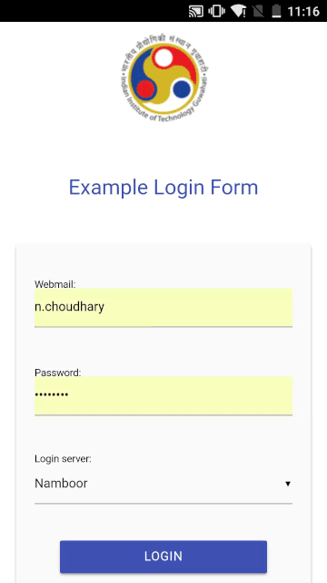

# django-iitg-auth : example

Example project for [django-iitg-auth](https://github.com/narenchoudhary/django-iitg-auth)

## Run 

Using virtualenv is not necessary, but recommended.

    $ git clone https://github.com/narenchoudhary/django-iitg-auth-example
    
    $ cd django-iitg-auth-example
    
    $ virtualenv --python=/usr/bin/python2 venv  # can use python3 also
    Running virtualenv with interpreter /usr/bin/python2
    New python executable in /home/narendra/Desktop/github/django-iitg-auth-example/venv/bin/python2
    Also creating executable in /home/narendra/Desktop/github/django-iitg-auth-example/venv/bin/python
    Installing setuptools, pip, wheel...done.

    $ source venv/bin/activate
    
    (venv) $ cd example
    
    (venv) $ pip install -r requirements.txt
    Collecting django-iitg-auth==0.0.4 (from -r requirements.txt (line 1))
      Using cached django_iitg_auth-0.0.4-py2.py3-none-any.whl
    Collecting Django>=1.7 (from django-iitg-auth==0.0.4->-r requirements.txt (line 1))
      Using cached Django-1.11.11-py2.py3-none-any.whl
    Collecting pytz (from Django>=1.7->django-iitg-auth==0.0.4->-r requirements.txt (line 1))
      Using cached pytz-2018.3-py2.py3-none-any.whl
    Installing collected packages: pytz, Django, django-iitg-auth
    Successfully installed Django-1.11.11 django-iitg-auth-0.0.4 pytz-2018.3
    
    (venv) $ ./manage.py migrate
    
    Operations to perform:
      Apply all migrations: admin, auth, contenttypes, sessions
    Running migrations:
      Applying contenttypes.0001_initial... OK
      Applying auth.0001_initial... OK
      Applying admin.0001_initial... OK
      Applying admin.0002_logentry_remove_auto_add... OK
      Applying contenttypes.0002_remove_content_type_name... OK
      Applying auth.0002_alter_permission_name_max_length... OK
      Applying auth.0003_alter_user_email_max_length... OK
      Applying auth.0004_alter_user_username_opts... OK
      Applying auth.0005_alter_user_last_login_null... OK
      Applying auth.0006_require_contenttypes_0002... OK
      Applying auth.0007_alter_validators_add_error_messages... OK
      Applying auth.0008_alter_user_username_max_length... OK
      Applying sessions.0001_initial... OK
      
    (venv) $ ./manage.py createsuperuser
    Username (leave blank to use 'narendra'): 
    Email address: 
    Password: 
    Password (again): 
    Superuser created successfully.
    
    (venv) $ ./manage.py runserver
    Performing system checks...

    System check identified no issues (0 silenced).
    March 25, 2018 - 10:25:32
    Django version 1.11.11, using settings 'example.settings'
    Starting development server at http://127.0.0.1:8000/
    Quit the server with CONTROL-C.

Now go to admin-panel (http://localhost:8080/admin) and log in using super-user credentials. Create a User entry with `username` set to your web-mail username and set password to any random value. Password need not be set to your web-mail password.

Logout of admin panel.

Go to http://localhost:8080/app/login.

Use your web-mail username and password to login.

